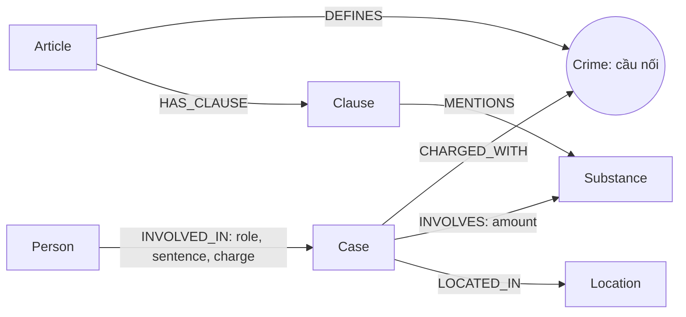

# Thiết kế Ontology — Day 19

**Họ tên:** Phạm Thanh Trung  **MSSV:** 2A2202602949

- [x] Dùng ontology gợi ý (chỉnh provenance của Person)
- [ ] Tự thiết kế (bonus)

## 1. Sơ đồ

## 2. Entity types

| Label | Ý nghĩa | Khóa MERGE | Properties | KB | Trích xuất |
|---|---|---|---|---|---|
| Article | Một Điều luật | id | id, title, law, doc_id | Luật | Metadata + regex |
| Clause | Một khoản của Điều | id (Điều + khoản) | id, number, penalty, text, doc_id | Luật | Regex đầu dòng số + dấu chấm |
| Crime | Tội danh chuẩn dùng chung | name | name | Cả hai | Tên Điều + LLM, link_entity |
| Case | Vụ việc trong bài | name | name, summary, date, source_title, doc_id | Tin | LLM |
| Person | Người tham gia vụ | name | name, aliases, doc_id | Tin | LLM |
| Substance | Chất dùng chung | name | name | Cả hai | Danh sách chuẩn + regex/LLM |
| Location | Địa điểm dùng chung | name | name | Tin | LLM |

Article, Clause, Case, Person mang doc_id của tài liệu tạo ra chúng. Crime, Substance và Location có thể được nhiều tài liệu dùng chung nên không gán một nguồn duy nhất. Person dùng khóa tên còn hạn chế: nếu cùng tên xuất hiện ở hai nguồn thì doc_id có thể bị ghi đè; cần kiểm tra bằng dữ liệu thật.

## 3. Relationships

| Type | Từ → Đến | Properties | Ý nghĩa |
|---|---|---|---|
| DEFINES | Article → Crime | Không | Điều luật định nghĩa tội |
| HAS_CLAUSE | Article → Clause | Không | Khoản thuộc Điều |
| MENTIONS | Clause → Substance | Không | Khoản nhắc chất |
| CHARGED_WITH | Case → Crime | Không | Tội danh của vụ |
| INVOLVES | Case → Substance | amount | Loại chất và khối lượng |
| LOCATED_IN | Case → Location | Không | Địa điểm vụ |
| INVOLVED_IN | Person → Case | role, sentence, charge | Vai trò, mức án, tội từng người |

## 4. Node cầu nối giữa hai KB

Crime nối Case của tin với Article của luật. Substance tạo đường bổ sung qua Clause, nhưng tội danh xác định Điều luật trực tiếp hơn. Prompt liệt kê tội danh chuẩn lấy từ luật. link_entity chuẩn hóa khoảng trắng, chữ thường, tiền tố “tội”, khớp chính xác rồi difflib cutoff 0.8; trả nguyên tên trong danh sách chuẩn.

Cầu gãy khi bài không nêu tội danh, LLM bỏ sót hoặc tên quá khác chuẩn. Không ép nối khi độ giống thấp: giữ vụ việc, kiểm tra Case thiếu CHARGED_WITH và đối chiếu bài gốc trước khi bổ sung alias. Bài tuyên truyền không có vụ cụ thể trả cases rỗng là hợp lý.

## 5. Competency questions

| Câu | Đường đi | Khả năng và giới hạn |
|---|---|---|
| Q1 | Article → HAS_CLAUSE → Clause; kết hợp chunk luật | Định nghĩa tiền chất nằm trong text; không có node Definition riêng, Flat context vẫn cần. |
| Q2 | Person → INVOLVED_IN → Case | Đọc sentence tìm hai bị cáo tử hình; phụ thuộc trích đúng vụ 36kg. |
| Q3 | Person → Case → Crime ← Article → Clause | Lấy 36 tháng trên cạnh, Điều 251 và khoản 1. |
| Q4 | Person (name/aliases) → Case → Crime ← Article → Clause | Nối Hoàng Nato tới Điều 255; bộ lọc khoản có thể bỏ mức tối đa không nhắc chất. |
| Q5 | Person → Case → Substance; Case → Crime ← Article → Clause → Substance | Lấy MDMA/khối lượng, khoản Điều 250; LLM đọc text ngưỡng, chưa so sánh số tự động. |
| Q6 | Substance ← INVOLVES ← Case ← INVOLVED_IN ← Person | Seeds MDMA mở sang vụ liên quan; giới hạn facts và alias chất có thể gây thiếu. |

## 6. Quyết định thiết kế và đánh đổi

1. Chọn Crime làm cầu thay vì Person: người không có trong luật, tội xuất hiện ở cả hai KB. Fuzzy hỗ trợ “túy/tuý” nhưng có nguy cơ gán tội gần tên; cutoff 0.8 và từ chối tên không đủ giống.
2. Regex cho luật, LLM cho tin thay vì LLM toàn bộ: giảm request, giữ nguyên text; regex có thể bỏ cấu trúc đặc biệt/penalty không nằm dòng đầu.
3. Giữ text khoản và amount chuỗi thay vì schema ngưỡng số: đúng phạm vi lab, không giả định đơn vị; chưa tự quyết định khoản bằng thuật toán, có thể tăng token.
4. Khóa tên và constraint unique theo gợi ý thay vì định danh vụ/người mới: gộp cùng chuỗi nhưng không giải quyết đồng danh, biệt danh, vụ nhiều tên.

## 7. So với ontology gợi ý

Không xét bonus. Giữ nguyên bảy label và bảy loại cạnh; thêm doc_id trên Person. Không tuyên bố đây là ontology mới hoặc có cải thiện chưa đo.

## 8. Hạn chế còn lại

Chưa mô hình hóa giai đoạn tố tụng, ngưỡng khối lượng có đơn vị, đồng danh và provenance nhiều nguồn. KG-3 lọc khoản 1 và khoản nhắc chất; câu hỏi mức phạt tối đa có thể cần khoản khác. REPORT_KG phải đối chiếu graph và câu trả lời benchmark thực tế.
